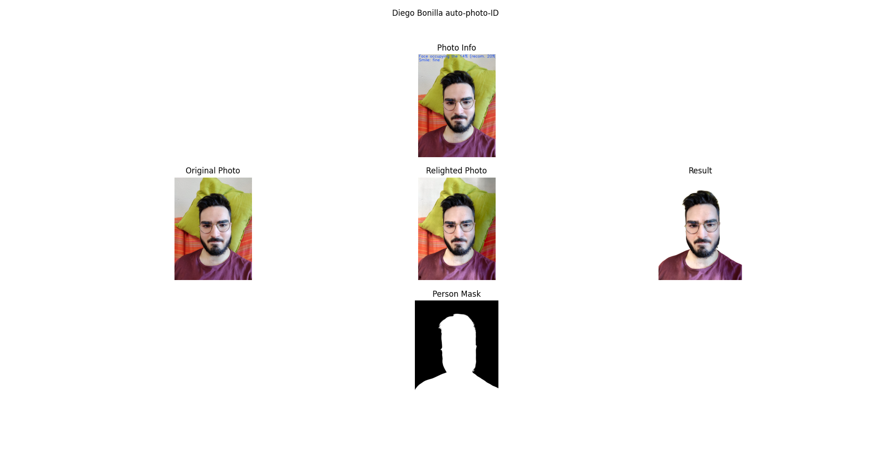

# Deep-Learning-Auto-ID-photo-Enhancer
A learning based ID photo maker.
Shadow removal model from this [paper](https://openaccess.thecvf.com/content_ICCV_2019/papers/Zhou_Deep_Single-Image_Portrait_Relighting_ICCV_2019_paper.pdf).

## Output

## Steps
1. Smile and face size check to match the desired resolution.
2. Shadow removal. Using the previous mentionated deep learning based method.
3. Background subtraction using the RemoveBG API.

## Warning!
This is some scripts I've made for tests and/or meaningless projects. They are not made to be easy to understand, optimized nor working. They surely have some interesting stuff so for any questions please talk to me in [Linkedin](https://www.linkedin.com/in/diego-bonilla-salvador/).

